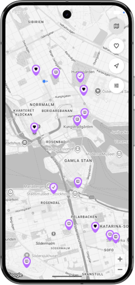
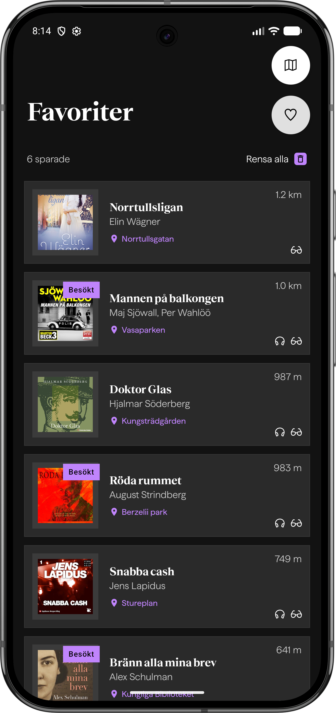

<div align="center">

# 📚 BookMap

<p align="center">
  
  
  
</p>

[](https://github.com/matildaerenius/bookmap/actions/workflows/android.yml)

> **A final thesis project for the Java Developer program at Nackademin, created in collaboration with BookBeat** 🎓

</div>

<br>

**Bookmap** is a native Android application that connects literature with geography. The app fetches a curated list of book-related locations from a remote JSON source (GitHub Gist), syncs them with detailed book data from the public BookBeat API, and displays them as interactive markers using the Google Maps SDK 📍

---

## ✨ Features

* 🗺️ **Interactive Map:** Explore book-related locations in Stockholm using Google Maps.
* 🖼️ **Rich Summaries:** Tap markers to view book covers, authors, format availability, and location connection texts.
* ❤️ **Favourites:** Save book locations locally and view them on a separate favourites screen.
* ✅ **Visited Locations:** Mark locations as visited and track your literary journey.
* 🎛️ **Dynamic Filters:** Filter the map by all markers, favourites, visited, or unvisited locations.
* 🚶 **Google Maps Navigation:** Open walking directions to selected locations in Google Maps.
* 💾 **Local Storage:** Room database support for cached markers, favourites, and visited locations.

---

## 🛠 Tech Stack
* **Language:** Kotlin 
* **UI:** Jetpack Compose
* **Architecture:** MVVM, Clean Architecture
* **Dependency Injection:** Dagger Hilt
* **Networking:** Retrofit, Kotlinx Serialization
* **Local Storage:** Room
* **Mapping:** Google Maps SDK for Android 
* **Image Loading:** Coil
* **Testing:** JUnit, MockK, Turbine, MockWebServer, Room Testing
* **CI/CD:** GitHub Actions

---

## 🧱 Architecture Overview

BookMap follows an MVVM structure with Clean Architecture-inspired layering:

* **Presentation layer:** Jetpack Compose screens, ViewModels, UI state, and UI events.
* **Domain layer:** Core models, repository interfaces, and use cases.
* **Data layer:** Retrofit APIs, Room database, DAOs, repository implementations, DTOs, entities, and mappers.

The app combines a custom location dataset from GitHub Gist with official book metadata from BookBeat’s public API. The merged marker data is cached locally with Room and observed through Kotlin Flow, allowing the UI to update reactively.

---

## 📱 Screenshots

<p align="center">
  
  &nbsp;&nbsp;&nbsp;&nbsp;
  
  <br><br>
  
  &nbsp;&nbsp;&nbsp;&nbsp;
  
</p>

---

## 🚀 Getting Started

### Prerequisites
* Android Studio (Koala Feature Drop or newer recommended)
* Minimum SDK: 24 (Android 7.0)
* Target SDK: 36 (Android 16)
* A valid Google Maps API key
  
### 1. Clone the repository
Open your terminal and run the following command:
```
git clone https://github.com/matildaerenius/bookmap.git
```

### 2. Set up the API Key
* Create a file named `local.properties` in the root directory of the project.
* Add your Google Maps API key to the file like this:
  ```properties
  MAPS_API_KEY=your_actual_api_key_here
  ```
* The project uses the **Secrets Gradle Plugin for Android** to securely inject this key during the build process.

> 💡 **Tip:** See the [Google Maps API Key Setup](../../wiki/Google-Maps-API-Key-Setup) wiki page for instructions.

### 3. Build and Run
* Open the cloned directory in **Android Studio**.
* Let Gradle sync and download all dependencies.
* Click the **Run** button to deploy the app to your emulator or physical device.

---

## 📖 Documentation
For a deeper dive into the development process, architectural decisions, and technical details of BookMap, please refer to the resources below:

* 📄 **[Thesis Report (PDF)](docs/report.pdf)**
  
* 🌐 **[Project Wiki](https://github.com/matildaerenius/bookmap/wiki)**

---

## 👩‍💻 Author
**Matilda Erenius**

[](https://www.linkedin.com/in/matildaerenius)
[](https://github.com/matildaerenius)

---

## 📄 License
This project is licensed under the Apache-2.0 License.
